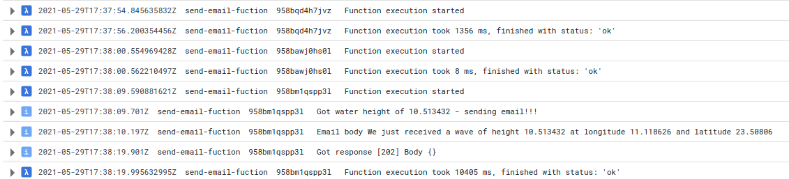

# send-email-lambda
Alerting and Visualization - Trigger Alert via Email Using Cloud PubSub, Cloud Functions &amp; SendGrid API

The cloud function can be found at [SendEmail.java](src/main/java/com/example/SendEmail.java). The function
requires 3 environment variables:
* SENDGRID_API_KEY - the API generated
* SENDGRID_FROM_EMAIL - sender email, it's required a verified email
* SENDGRID_TO_EMAIL - recipient of email

Had to register a real email at Sendgrid, because a FROM email needs to be a verified Sender Identity. Otherwise, 
the call to send the email will fail, with HTTP status code 403 and body:

```
  The from address does not match a verified Sender Identity. Mail cannot be sent until this error is resolved. 
  Visit https://sendgrid.com/docs/for-developers/sending-email/sender-identity/ to see the Sender Identity 
  requirements
```

These are the execution logs:



The first 2 execution produced no email, but the 3rd had `maximum_water_height` >= 10 meters, so an email was sent.
We got HTTP status code 202 - Accepted. Body of email can be seen in log entry. 
